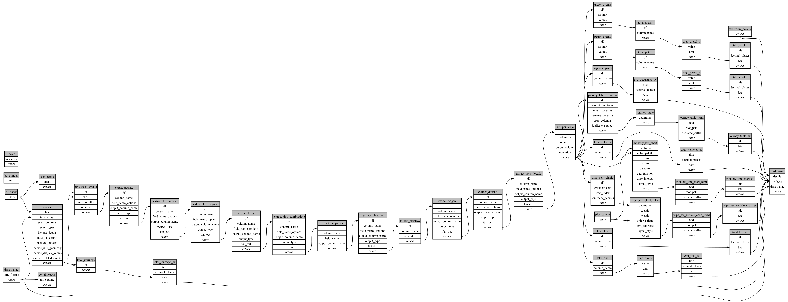

```
# AUTOGENERATED BY ECOSCOPE-WORKFLOWS; see fingerprint in README.md for details

```

```yaml
# fingerprint:
artifacts_sha256_basic: 883efe47bd44963c1c05f43257cb73de0ba03cb8470c57419c9396c72621af0d
artifacts_sha256_strict: 2b8c752acc7f4d20b0a3c13361a0df4c27c18a454543231eb9a0d07c73a5cd6f
installed_requirements:
- channel: https://repo.prefix.dev/ecoscope-workflows/
  name: ecoscope-platform
  version: {version: ==2.23.0}
- channel: https://repo.prefix.dev/ecoscope-workflows-custom/
  name: ecoscope-workflows-ext-custom
  version: {version: ==0.1.0rc23}
- channel: conda-forge
  name: pydeck
  version: {version: ==0.9.2}
- channel: https://repo.prefix.dev/ecoscope-workflows-custom/
  name: ecoscope-workflows-ext-apn
  version: {version: ==0.0.30}
params_sha256: 70e77697447096efb9cad1e1b3612351c30e90bf153e53c053d718c24d073bf1
spec_sha256: 4b1b91f15b6d75ab635003aed745e2708c1fed83def8e1b3cd32440121d085c6

```

# ecoscope-workflows-vehicle-summary-workflow


